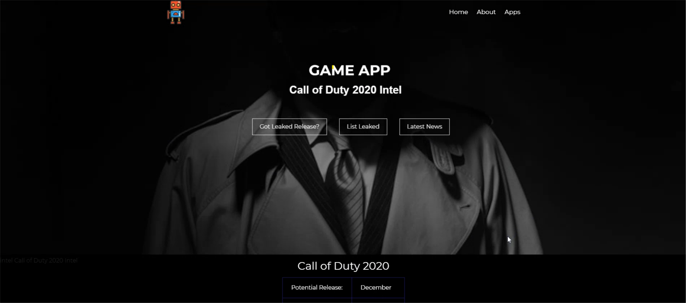

# Django Live Project

## Introduction

For the first two weeks as a intern at Prosper IT Consulting, I worked with my peers in a team developing a full scale MVC/MVVM Web Application in Python. Working on a legacy codebase was a great learning oppertunity for fixing bugs, cleaning up code, and adding requested features. There were some big changes that could have been a large time sink, but we used what we had to deliver what was needed on time. I saw how a good developer works with what they have to make a quality product. I worked on several back end stories that I am very proud of. Because much of the site had already been built, there were also a good deal of front end stories and UX improvements that needed to be completed, all of varying degrees of difficulty. Everyone on the team had a chance to work on front end and back end stories. Over the two week sprint I also had the opportunity to work on some other project management and team programming skills that I'm confident I will use again and again on future projects.



Below are descriptions of the stories I worked on, along with code snippets and navigation links. I also have some full code files in this repo for the larger functionalities I implemented.

## Back End Stories


- [GameApp Back-End](#gameapp-back-end)


### GameApp Back-End
The GameApp Backend was a series of stories that involved creating a database and connecting it to front end


```py

class Games_UpComing(models.Model):
    Game_Name = models.CharField(max_length=250, verbose_name="Game Name")
    Release = models.CharField(max_length=250, verbose_name="Potential Release")
    Main_Console = models.CharField(max_length=250, verbose_name="Main Console")
    Sources =models.CharField(max_length=250, verbose_name="Spy Sources")

    eventModel = models.Manager() # Object manager
```

Examples of Model View work

```py
def addEvent(request):
    form = GamesUpComingForm(request.POST or None) # gets the pasted form, if one exists
    if form.is_valid(): #checks the form for errors, ensuring it's filled in
        form.save() #saves the valid form to the database
        return redirect('game')
    else:
        print(form.errors) #prints any errors for the posted form to the form to the terminal
        form = GamesUpComingForm() #Creates a new black form
    return render(request,'GameApp/Game_App_Create.html', {'form': form})

def edit_Event(request, pk):
    pk = int(pk)
    event = get_object_or_404(Games_UpComing, pk=pk)
    if request.method == 'POST':
        form = GamesUpComingForm(request.POST, instance=event)
        if form.is_valid():
            events = form.save()
            events.save()
            return redirect('eventDetails', pk=events.pk)
        else:
            print(form.errors)
            form = GamesUpComingForm(instance=event)
    else:
        form = GamesUpComingForm(instance=event)
        context = {'form': form, 'pk': pk}
        return render(request, 'GameApp/Game_App_Edit.html', context)

```

And using Django Template Tags to render, connect to functions and views

```py
     <form method="post">
        
            <table class="mx-auto" >
                 {{form.as_table}}
            </table>
                {{form.non_filed_errors}}

            <div class="centerButtons2 mt=3">
                <button class="contact-btn" type="submit">Save Changes</button>
                <button class="contact-btn" type="button" onclick= "location.href=''">Delete Event</button>
                <button class="contact-btn" type="button" onclick="location.href=''">Back to Events</button>
            </div>
    </form>
```


Jump to: [Font End Stories](#front-end-stories), [Back End Stories](#back-end-stories),  [Page Top](#django-live-project)

## Front End Stories

- [Datascrapping](#datascrapping)


### Datascrapping
Using beautiful Soap I had scaped from a website and render to a webpage necessary information


```py
from bs4 import BeautifulSoup as BS
```

```py
def game_News(request):
    print('Hello World')
    source = requests.get('https://www.gameinformer.com/news')
    print(source.status_code)
    soup = BS(source.content, 'html.parser')
    nodes = soup.find_all(class_="views-row")
    articles = []
    for node in nodes:
        title = node.find(class_="field field--name-title field--type-string field--label-hidden").get_text()
        img = node.find('img').get("src")
        summary = node.find(class_="field field--name-field-promo-summary field--type-string field--label-hidden gi5-field-promo-summary gi5-string field__item").get_text()
        author = node.find(class_="username").get_text()
        #type = node.find("h2").find("a").get_text()
        time = node.find(class_="field field--name-created field--type-created field--label-hidden").get_text()
        link = node.find('a').get('href')  # Sets link equal to the href of the a tag
        url = "https://www.gameinformer.com/news" + link  # Modifies the link to a full url, since the links were relative
        article = { 'img':img,'title': title, 'summary':summary, 'author':author, 'url': url, 'time':time}
        articles.append(article)
        context = {'articles': articles}
    return render(request, 'GameApp/Video_Games_News.html', context)

```
Using Django template tags to structure the page with bootstrap and personalized styling.
```py

 
 
 
  newsBG 

  Official News

        <div class="container news">
             <!-- Iterates through the array of articles -->
                <!-- Creates a new line for each item, sets the href to the full url, gives the article title and date -->
            <div id="test" class="row  row-no-gutters articles">
                <div class="col-2 col1">
                    <a href="{{article.url}}">
                        
                    </a>
                </div>
                <div class="col-10 col2">
                      <p class="newsDetails">
                        <a href="{{article.url}}">
                            <span class="title">{{article.title}}</span><br>
                               <span class="description">{{article.summary}}</span><br>
                            <span class="author">by {{article.author}} on <i>{{article.time}}</i></span>
                        </a>
                    </p>
                </div>
            </div>
            
        </div>



```


The personalized styling find on external CSS 
```css
.news{
    border-bottom: .18rem solid #f6f6f6 !important;
    text-align: justify;

}

.newsDetails{
    text-align: justify;
}
.articles{
    color: white !important;
    margin: 25px 20px;
    margin-left: 150px;
    width: 70%;
    border-bottom: 1px solid white;

}
.articles:hover{
    border-bottom: 2px  solid red;
}

.newsImage{
    width: 250px;
    max-height: auto;
    margin: 0px;
    padding-right: -125px;
    margin-left: 330px;
}

.title{
    font-weight: bold;
    font-family: Montserrat Helvetica, Ubuntu, Roboto, Noto, Arial, sans-serif;
    color: white !important;

}
.title:hover{
    color: red !important;

}
.description{
    font-size: 16px;
    font-family: Montserrat Helvetica, Ubuntu, Roboto, Noto, Arial, sans-serif;
}
```
Background Hero

```css
.newsBG {
    background: linear-gradient(rgba(0,0,0,0.5),rgba(0,0,0,0.5)), url('./images/news.jpg') right bottom;
    background-repeat: no-repeat;
    background-size: cover;
    height: 80vh;
  }
```


Jump to: [Font End Stories](#front-end-stories), [Back End Stories](#back-end-stories),  [Page Top](#django-live-project)
